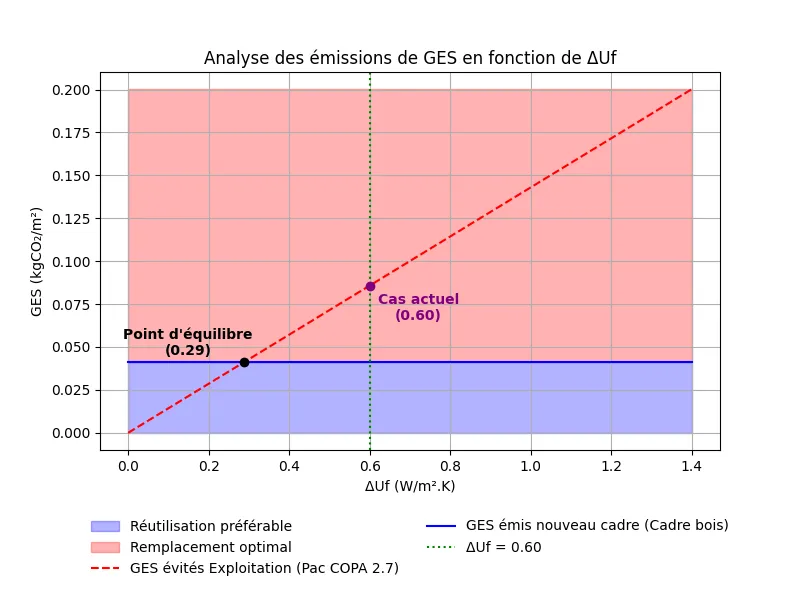

# Analyse des Émissions de GES en Fonction de ΔUf (W/m².K)

Ce projet permet d'analyser l'impact environnemental d'un remplacement de cadre de fenêtre en fonction de l'évolution de l'indicateur thermique `ΔUf` (W/m².K). Grâce à une régression linéaire et des calculs d'émissions de gaz à effet de serre (GES), le programme aide à déterminer si le remplacement du cadre de fenêtre est optimal ou si la réutilisation du cadre existant est préférable. Le calcul et l'affichage sont accompagnés de graphiques pour une visualisation plus claire des résultats.

## Table des matières

- [Description du projet](#description-du-projet)
- [Prérequis](#prérequis)
- [Installation](#installation)
- [Utilisation](#utilisation)
- [Exemple de graphique](#exemple-de-graphique)
- [Contributeurs](#contributeurs)
- [License](#license)

## Description du projet

Ce programme utilise des données préexistantes sur les types de cadres de fenêtres (bois, PVC, aluminium, etc.) pour estimer la performance thermique (Uf) d'un cadre en fonction de l'année de fabrication et du matériau. Le but est de déterminer la meilleure option entre remplacer un cadre existant par un modèle plus performant ou réutiliser le cadre actuel pour minimiser l'empreinte carbone.

Les calculs sont effectués à l'aide d'une régression linéaire qui estime `Uf` pour une année donnée, et un modèle permet d'analyser les émissions de CO₂ évitées en fonction du remplacement ou de la réutilisation des cadres.

## Prérequis

Avant de commencer, vous devez avoir Python 3 installé sur votre machine ainsi que les bibliothèques suivantes :

- `numpy` : pour les calculs numériques
- `matplotlib` : pour la création de graphiques
- `scikit-learn` : pour la régression linéaire
- `PIL` (Pillow) : pour la manipulation d'images

Vous pouvez installer ces dépendances via `pip` :

## Utilisation 

Se rendre à l'adresse suivante pour utiliser le calculateur : https://huggingface.co/spaces/Gauthier76/test1

Information sur les fonctions :

- calculate_and_plot(system, material, uf_existing, uf_new) :
Cette fonction effectue les calculs des émissions de GES en fonction de ΔUf et génère un graphique qui aide à visualiser la rentabilité du remplacement ou de la réutilisation d'un cadre.

- estimate_uf(year, frame_type) : 
Cette fonction permet d'estimer Uf pour un cadre donné en fonction de l'année et du type de cadre (Bois, PVC, Alu, etc.). Les résultats sont obtenus par une régression linéaire entre les années 1950 et 2020.

## Exemple de graphique 

## Contributeur

Gauthier Demonchy - Heig-VD , Yverdon les bains Suisse